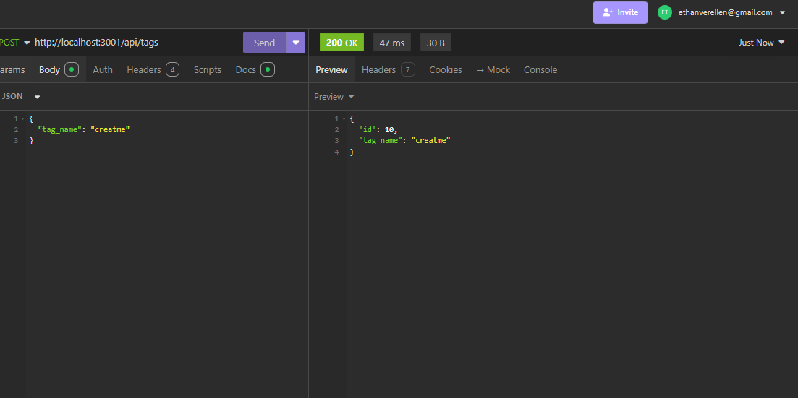
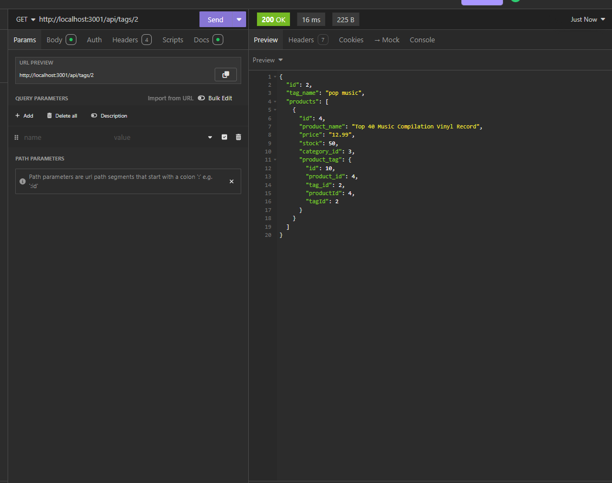
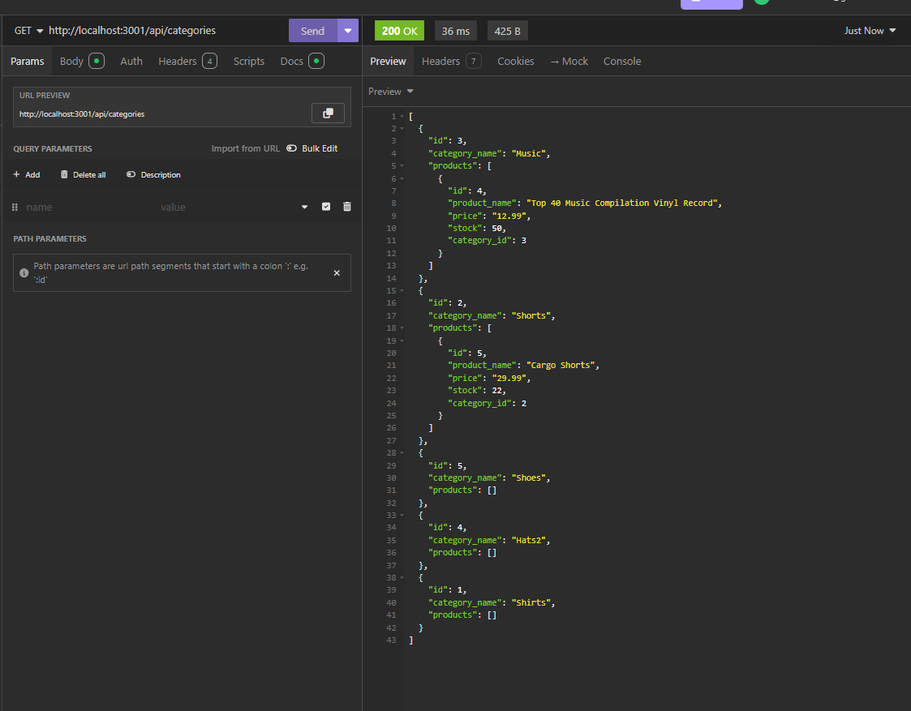

# API-Functionality

by Ethan Verellen

## Table of Contents

[Description](#description)

[Useage](#useage)

[Installation](#installation)

[Images](#images)

[Tests](#tests)

[Contributors](#contributors)

[Links](#links)

[Questions](#questions)

## Description

A way to experiment with basic API's and using backend programs like insomnia

## Useage

In order to use this project, I suggest you find it in a terminal/git and run the line npm i. Then you should go to the /db folder and go into postgres, and run \i schema.sql. Then go to the main page in the terminal and type /npm run seed.  Then type npm run start.  then open up a program like insomnia and go to the http://localhost:3001/api/(route) to be able to work with it.

## Installation

To install, Either download as a zip file from the repo, or git clone in gitbash or other equivelences.

## Images

## Tests

Launch it and look for errors

## Contributing

Ethan Verellen

## Links

https://github.com/Ethan-Verellen/Track-Your-Employees

## Questions

https://github.com/Ethan-Verellen

ethanverellen@gmail.com

